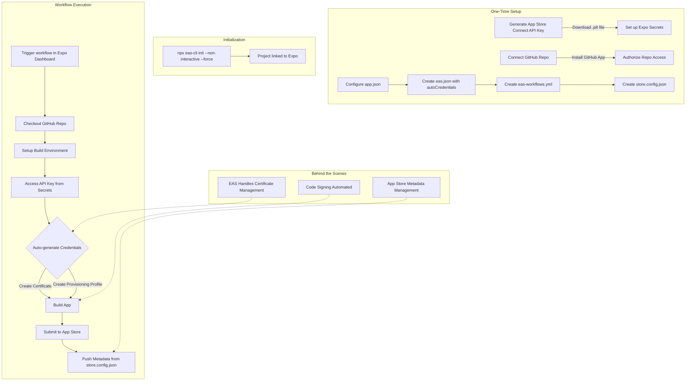

# EAS Workflow with API Key: Visual Guide



## Essential Files at a Glance

### 1. eas.json
```json
{
  "cli": {
    "version": ">=16.3.0",
    "requireCommit": false,
    "appVersionSource": "local"
  },
  "build": {
    "production": {
      "distribution": "store",
      "ios": {
        "resourceClass": "m1-medium"
      },
      "channel": "production",
      "autoIncrement": true,
      "autoCredentials": true,
      "credentialsSource": "remote"
    }
  },
  "submit": {
    "production": {
      "ios": {
        "ascAppId": "${EXPO_ASC_APP_ID}",
        "appleTeamId": "${EXPO_APPLE_TEAM_ID}"
      }
    }
  },
  "extend": {
    "workflows": true
  }
}
```

### 2. eas-workflows.yml
```yaml
env:
  EXPO_APPLE_APP_STORE_CONNECT_API_KEY_ID: ${{ secrets.APPLE_API_KEY_ID }}
  EXPO_APPLE_APP_STORE_CONNECT_API_KEY_ISSUER_ID: ${{ secrets.APPLE_API_ISSUER_ID }}
  EXPO_APPLE_APP_STORE_CONNECT_API_KEY_CONTENT: ${{ secrets.APPLE_API_KEY_CONTENT }}
steps:
  - uses: checkout
  - uses: eas-build
  - uses: eas-submit
  - uses: eas-metadata-push
```

### 3. store.config.json
```json
"stores": {
  "ios": {
    "ascApiKeyId": "${EXPO_APPLE_API_KEY_ID}",
    "ascApiKeyIssuerId": "${EXPO_APPLE_API_ISSUER_ID}",
    "ascApiKeyPath": "${EXPO_APPLE_API_KEY_PATH}"
  }
}
```

## Quick Start Commands

```bash
# Set up API key secrets
eas secret:create --scope project --name APPLE_API_KEY_ID --value "YOUR_KEY_ID"

# Link project
npx eas-cli@latest init --non-interactive --force

# Run workflow
# (via Expo Dashboard or CLI)
eas workflow:run production-release
```

## Key Benefits

- 🔑 **No certificate management**
- 🚀 **Fully automated end-to-end**
- 🔄 **Works across environments**
- 👥 **Team-friendly**
- 🧩 **Version controlled configuration**
- ⚡ **Optimized builds** with resource class selection
- 🔢 **Auto versioning** with build number incrementation
- 🧰 **Extensible workflows** for CI/CD integration

## Resource Class Options

For iOS builds, you can choose resource classes:
- **m1-medium**: Standard performance (default)
- **m1-large**: Higher performance for complex apps
- **m-large**: Intel-based machines (legacy)

## Auto-Increment Feature

The `autoIncrement` setting automatically handles:
- Incrementing build numbers between submissions
- Ensuring unique build numbers for App Store
- Reducing manual version management
